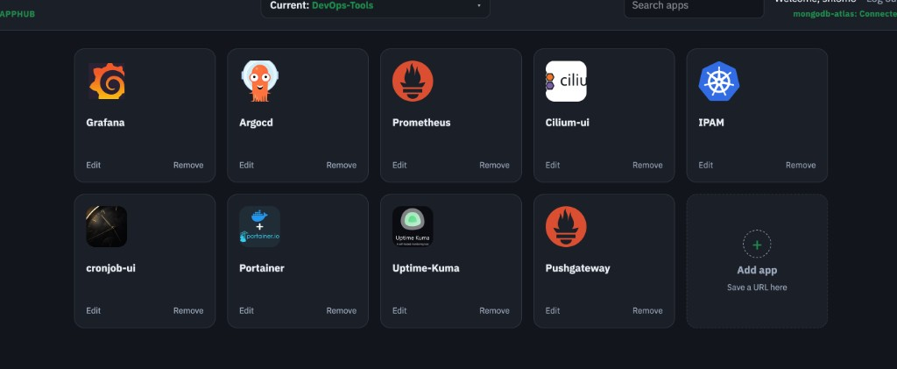

# AppHub

One place for all your resources — DevOps, networking, cloud tools, and anything else you want under one login.

Sign in, group links into sections, add tiles (name, URL, icon), and open them from a single dashboard. Port **8092**. Code is in `apphub-ui/`.



## Run

```bash
cd apphub-ui
cp docker-compose.example.yml docker-compose.yml   # if you do not have one yet
# edit docker-compose.yml with your login and Mongo values (file is gitignored)
docker compose up -d --build
```

Open http://localhost:8092. Do not commit `docker-compose.yml` or real credentials.

```bash
docker compose down
```

## Config

| Variable | Description |
|----------|-------------|
| `APPHUB_USER` / `APPHUB_PASSWORD` | Login |
| `USE_MONGODB` | `true` = Mongo, `false` = local JSON |
| `MONGO_HOST` | Atlas host or `mongo` |
| `MONGO_DB` | Database name |
| `MONGO_URI` | Optional full URI |
| `MONGO_INITDB_ROOT_USERNAME` / `MONGO_INITDB_ROOT_PASSWORD` | Mongo credentials |
| `TZ` | Timezone |

## What you get

- Sections (tabs) for grouping apps — create, rename, delete
- Apps with custom icons (upload or URL)
- Search, dark mode, idle logout
- MongoDB Atlas, local Mongo, or file storage

Default sections: DevOps-Tools, Networking-Tools, Clouds.

## API

Session cookie after `POST /api/login`. Main routes: `/api/me`, `/api/apps`, `/api/sections`, `/api/icons/{filename}`.
